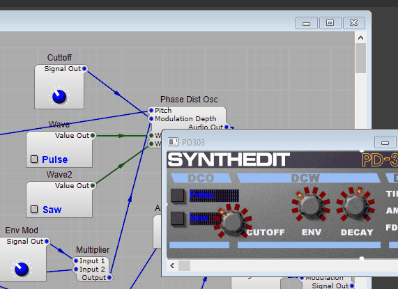
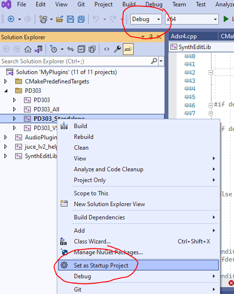
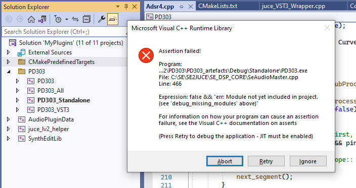
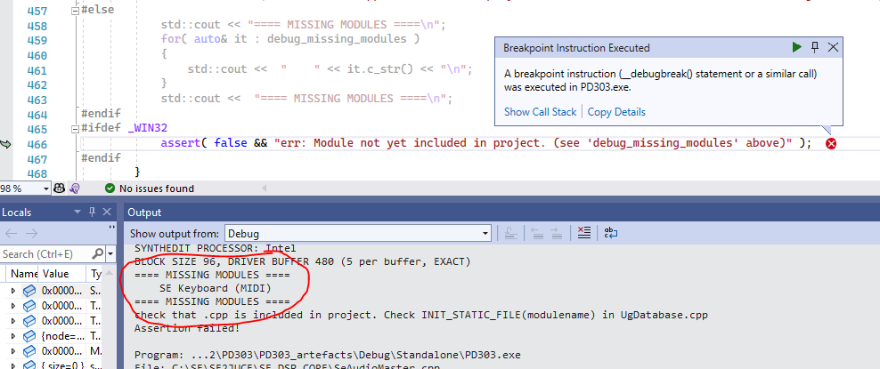
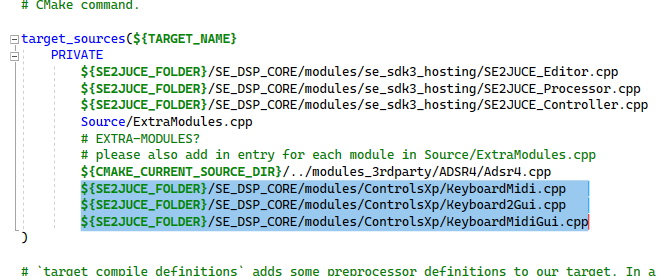
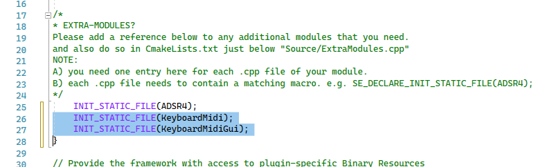
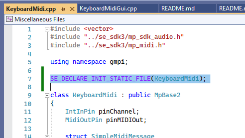
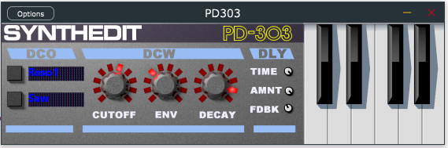

# Introduction 
SE2JUCE supports exporting SynthEdit projects to C++ JUCE projects.

JUCE Projects
* Can target more plugin formats than SynthEdit alone, like AAX, Standalone, VST2 and CLAP etc.
* Hide all resources and SEMs inside a single binary file.
* Can display the GUI you created in SynthEdit, or a custom GUI made with JUCE.

Note that using SE2JUCE is a complex, advanced proceedure that involves programming in C++ and having an understanding of CMake and JUCE.
Also SE2JUCE requires you to have access to the source-code of any SEMs you wish to use. This may not be possible in some cases,
 especially with 3rd-party modules. 3rd-party module creators have no obligation to share their source-code.

# Prerequisites

Install SynthEdit 1.5. https://synthedit.com/downloads/?url=/downloads

Install Visual Studio or your IDE of choice. https://visualstudio.microsoft.com/vs/

Install CMake. https://cmake.org/download/

# Getting Started with the PD303 example
clone SE2JUCE repo. https://github.com/JeffMcClintock/SE2JUCE

get JUCE. https://juce.com/get-juce/download

Optional:
* add VST2 headers to JUCE if you need to make VST2 plugins.
* get AAX SDK if you need it. https://www.avid.com/alliance-partner-program/aax-connectivity-toolkit

clone SE2JUCE_Projects repo. This provides an example plugin you can copy. https://github.com/JeffMcClintock/SE2JUCE_Projects

(to export your own plugin, copy the entire PD303 folder, rename it and edit the two cmakelists.txt files, changing the plugin name etc)

Open SynthEdit

open project from SE2JUCE_Plugins/PD303/SE_Project/PD303.se1

Choose menu "File/Export Juce" This will copy the project and its skin to the 'Resources' folder of the JUCE project.

close SE

Open CMake GUI

Under "where is the source code" enter the location of SE2JUCE_Plugins folder

Under "where to build the binaries" enter something like C:\build_SE2JUCE_Plugins (or anywhere you prefer to put the temporary files created during the build).

Click 'Configure", and choose whatever IDE you prefer. Ignore the error message.

Look for the variables 'JUCE_FOLDER_HERE' and 'SE2JUCE_FOLDER_HERE' . Browse for your actual JUCE folder, and the correct SE2JUCE folder

click 'generate'

click 'open project' (your IDE should open)

build and try out the plugin

# Missing modules

Once you start exporting your own plugins with SE2JUCE you will likely experience crashes due to the plugin not containing some module it requires.

To identify which modules need to be added to the project, run the plugin or standalone app in a debugger. ('Set as Startup Project' the Standalone, set Solution Configuration to 'Debug', press 'Start Debugging F5')

When you run the standalone, it will crash (assert) at the point where it is trying to load the missing modules. (hit 'Retry' to break into the debugger)

You should see in the 'Output' Window a list of the missing modules.

In the example above, its the 'SE Keyboard (MIDI)' that is missing from the build.

# Adding an additional module

To add an extra module to the build you will need access to its source code. In the case of the keyboard, the code is in the *SE2JUCE\SE_DSP_CORE\modules\ControlsXp* folder, but not actually included in the build yet.

Open the *SE2JUCE_Plugins\PD303\CMakeLists.txt* file, look for the part that mentions 'Adsr4.cpp'. Add an additional reference to the new module you want to include. If the module has both GUI and DSP parts, add both.

Now open the file *SE2JUCE_Plugins/PD303/Source/ExtraModules.cpp* and add lines like the following.

Finally, add the *SE_DECLARE_INIT_STATIC_FILE* macro line to each module file (if not already done)

Build and run the Standalone app. The Keyboard module now works in the JUCE plugin.

# Presets
The plugin you build with SE2JUCE will save presets in xmlformat. Any preset the user saves will go to the folder:

Windows: C:\ProgramData\\*YourVendorName*\\*YourPluginName*\USER Presets

Mac: /Library/Application Support/*YourVendorName*/*YourPluginName*/USER Presets

Your plugin can also include read-only factory presets. To include any factory preset into the plugin binary, add it to the folder Resources/presets

# Further help and information

SynthEdit - https://groups.io/g/synthedit

JUCE - https://forum.juce.com/

AAX - https://www.avid.com/alliance-partner-program/aax-connectivity-toolkit

CLAP - https://github.com/free-audio/clap-juce-extensions

VST2 - https://forum.juce.com/t/how-to-offer-vst2-plugins-now/39195

